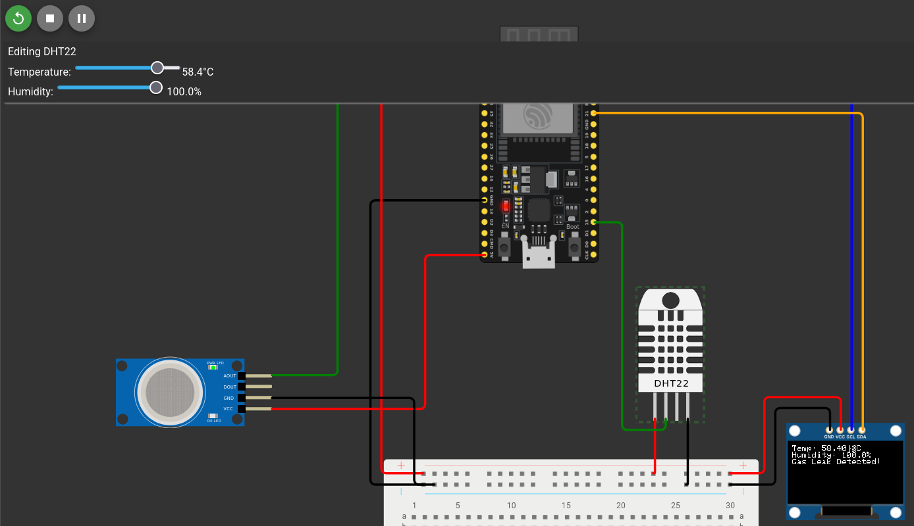
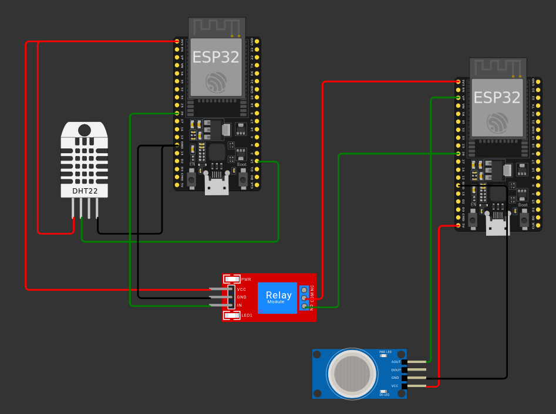
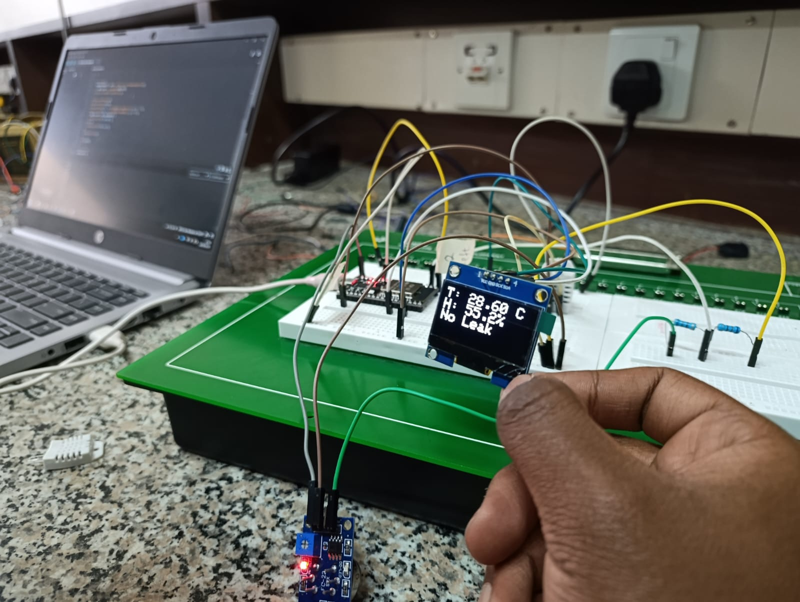
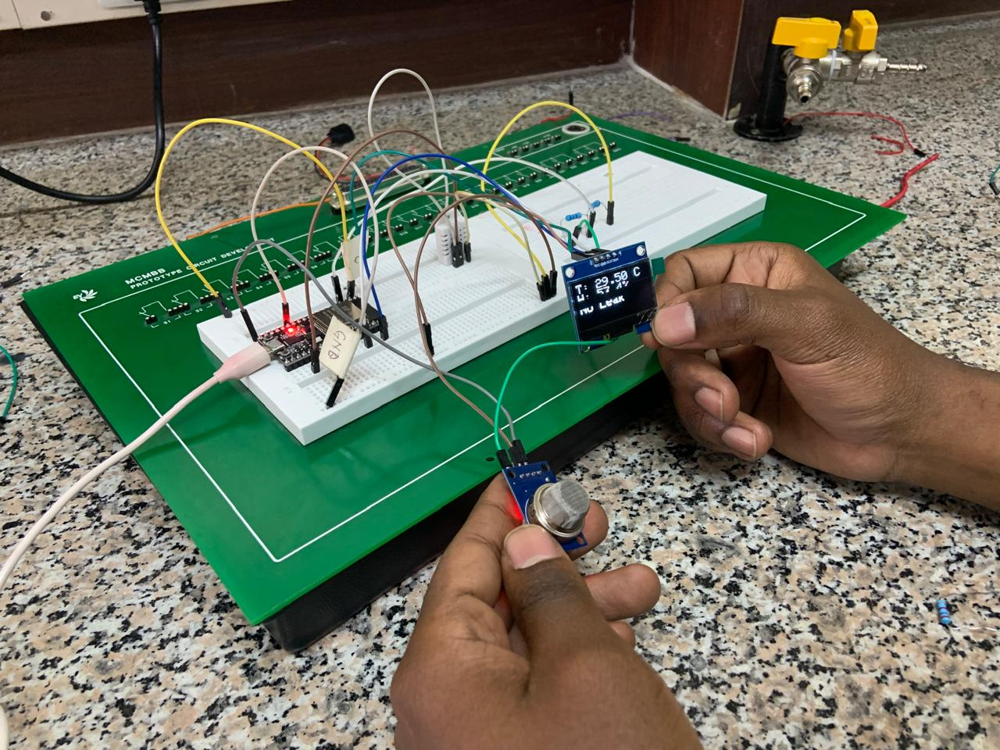
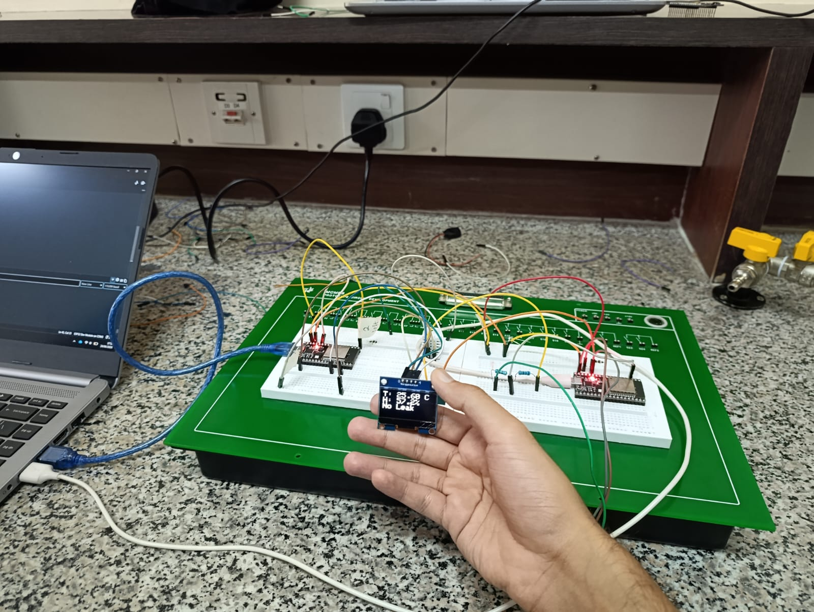
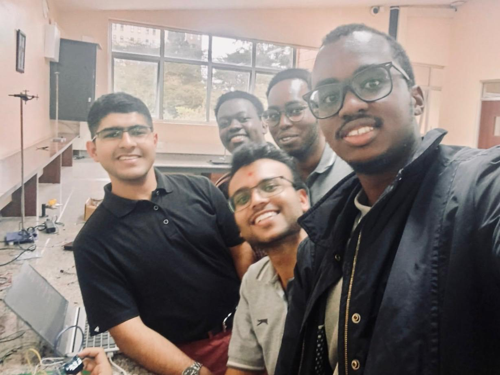

# IoT-Smester-Project-Deliverable-2
#### By Group 5 (Verdant) - Clyde, Lee, Vinit, Samwel, and Junaid.

## Table of Contents
- [Background](#background)
- [Wokwi Designs](#wokwi-designs)
    - [Circuit A](#circuit-a)
    - [Circuit C](#circuit-c)
- [Physical Prototypes](#physical-prototypes)
    - [Circuit A](#circuit-a-1)
        - [Video](#video)
    - [Circuit B](#circuit-b)
- [Group Photo](#group-photo)

## Background
This repository outlines the Wokwi simulated designs for a set of circuits designed in Deliverable 1 (which can be found [here](https://github.com/MJ-Chaudhry/IoT-Semester-Project-Deliverable-1)).

The aim of the deliverable was to simulate two of the circuits, specifically circuit A and either circuit B or C, and then build a physical prototype for the circuits.

We simulated circuit A and C in Wokwi, and built circuit A and B physicaly. The code for the physical prototypes can be found in their respective folders ([Circuit A](Circuit-A/), [Circuit B](Circuit-B/)).

**Note:** Due to the limitations of Wokwi, we weren't able to simulate two ESP32s simulataneosly, however the designs are still accurate enough to work with.

## Wokwi Designs
The code for each Wokwi simulation is also included in the link.
### Circuit A
[Wokwi Project Link](https://wokwi.com/projects/467060828437445633)

### Circuit C
[Wokwi Project Link](https://wokwi.com/projects/467693630725688321)

## Physical Prototypes
### Circuit A

#### Video
Below is a video sample showing how the temperature and humidity increased when a finger was placed close to the DHT22 sensor as well.
<video src="images/prototype-a/video.mp4" width="100%" controls></video>
### Circuit B

## Group Photo
